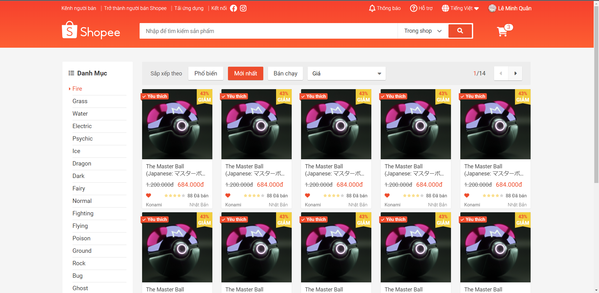
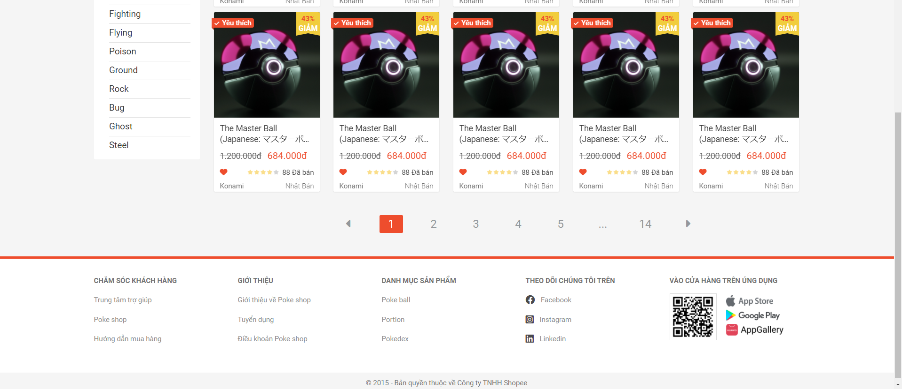

# ✨Trang web Shopee Clone

Đây là trang web **Shopee Clone** 🛒, thực hiện trong khoảng một tuần (chưa tính responsive).

Code được thực hiện theo các bài giảng của anh Sơn ở trang web [F8](https://fullstack.edu.vn/).

**Thời gian thực hiện:** 28/2/2022 - 8/3/2022 (chưa kể refactor và thay đổi nội dung).

**Kiến thức sử dụng:**

1. HTML&CSS bao gồm Flexbox, BEM, Grid System.
2. Javascript chỉ sử dụng DOM cơ bản để xử lý sự kiện và thay đổi nội dung/giao diện.

**Demo sản phẩm:**

**Về tác giả:**

[Github](https://github.com/marucube35)\
[Facebook](https://www.facebook.com/profile.php?id=100009916021095)
